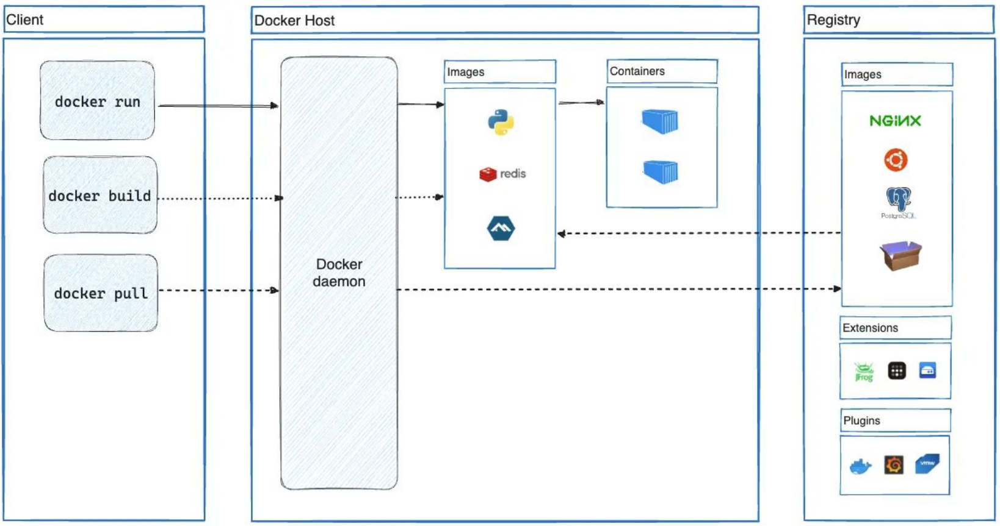
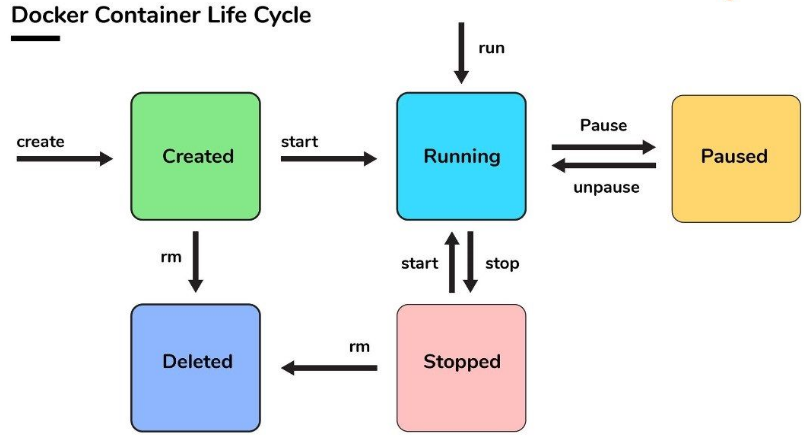

# Docker Basics

Repositório para me familiarizar e absorver conceitos básicos relativos ao uso Docker etc.

## 1. Docker Architecture

	

A imagem ilustra a **arquitetura do Docker**, destacando como os diferentes componentes interagem

---

### **1.1. Client**
- O **cliente Docker** é a interface que os usuários utilizam para interagir com o Docker. É onde você executa comandos como:
  - **`docker run`**: Cria e executa um container.
  - **`docker build`**: Constrói uma imagem Docker a partir de um Dockerfile.
  - **`docker pull`**: Baixa uma imagem do registro (como o Docker Hub).

Esses comandos são enviados para o **Docker daemon** no Docker Host.

---

### **1.2. Docker Host**
O **Docker Host** é onde o Docker está realmente rodando. Ele contém:
- **Docker Daemon**:
  - Um serviço que gerencia imagens, containers, redes e volumes no Docker.
  - Ele é responsável por processar os comandos recebidos do cliente e realizar as ações, como iniciar containers ou construir imagens.
- **Images**:
  - São modelos de containers. Por exemplo:
    - A imagem Python para rodar aplicativos em Python.
    - A imagem Redis para banco de dados em memória.
  - Imagens são armazenadas localmente no host.
- **Containers**:
  - Instâncias em execução das imagens. Um container é uma aplicação isolada que utiliza os recursos da imagem de onde foi criado.

---

### **1.3. Registry**
O **registro** é um repositório onde as imagens Docker são armazenadas e compartilhadas. Pode ser:
- **Docker Hub** (registro público padrão do Docker).
- Registries privados, como o JFrog Artifactory ou Nexus.

Funções:
- **`docker pull`**: Baixa imagens do registry para o host.
- **`docker push`**: Envia imagens do host para o registry.

---

### Fluxo Representado na Imagem:
1. **Cliente (Client)**:
   - O usuário executa comandos (`run`, `build`, `pull`).
2. **Docker Daemon**:
   - Recebe os comandos do cliente e executa as ações no Docker Host.
3. **Imagens e Containers**:
   - As imagens são baixadas, armazenadas e usadas para criar containers.
4. **Registry**:
   - Fornece ou recebe imagens do Docker Host.

---

	

Essa arquitetura demonstra a modularidade e o fluxo de funcionamento do Docker, mostrando como as imagens são criadas, armazenadas e executadas como containers!

## Docker container life cycle

	

